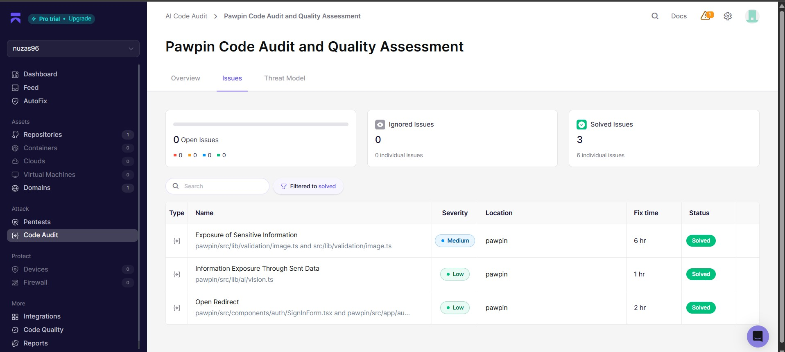

# PawPin Security & Privacy Report

PawPin manages sensitive community data and physical locations. We have designed a strict security model to prevent misuse, data leaks, and unauthorized access to precise cat locations.

## Location Privacy Model

Precise location data (e.g., coordinates) can be weaponized if exposed publicly.
PawPin mitigates this via **Fuzzy Geolocation Truncation**:

- Coordinates stored in the database are truncated in the backend map endpoints to **2 decimal places** (approximately 1.1km precision) for all public endpoints.
- Standard users only see the fuzzy coordinates.
- **Strict Role-Gating**: Only _Approved Volunteers_ and _Approved Organizations_ can query the exact `lat`/`lng` of a sighting.

## Supabase Row-Level Security (RLS)

The database enforces strict RLS policies on all tables:

- **Profiles**: Users can only update their own profile data. Admin accounts can update approval statuses.
- **Sightings**: Public users can insert sightings but can only update/delete sightings they own.
- **Cats**: Similar restrictions prevent vandalism of cat status or attributes.
- **Follows / Bookmarks / Notifications**: Private to the `user_id`. You cannot query someone else's notifications.

## Role-Gating and Approval Flow

PawPin uses a 3-tier role system:

1. `user`: Default. Can report and view public/fuzzy data.
2. `volunteer`: Elevated permissions.
3. `org`: Organization admin.
4. `admin`: System admin.

**Crucial Check**: Merely having the `volunteer` or `org` role is NOT enough. Users must have `is_approved = true`. This prevents bad actors from simply registering an "organization" account and gaining immediate access to exact coordinates.

## Environment Variables

- `NEXT_PUBLIC_SUPABASE_URL` and `NEXT_PUBLIC_SUPABASE_ANON_KEY` are the only exposed environment variables, which is safe due to Supabase RLS.
- Sensitive keys like `GEMINI_API_KEY` are heavily guarded, accessed only securely on the server environment.

## Image Metadata Sanitization

When a user uploads a photo from their phone, it often contains hidden EXIF/GPS metadata which could inadvertently expose the precise location of the cat, circumventing our fuzzy location privacy model.
PawPin fixes this by:

- Employing a strict, fail-closed metadata stripper server-side for JPG and PNG files.
- Rejecting WEBP formats since their metadata cannot be safely stripped without heavy native dependencies.
- Any image that is malformed or cannot have its metadata cleanly stripped is rejected with a user-friendly error.

## AI Vision Sent-Data Security

PawPin uses Gemini Vision API, but does so with privacy in mind:

- Only the sanitized image bytes (metadata stripped) are sent to the LLM.
- No user identity, reporter contact, precise location, or fuzzy coordinates are ever included in the prompt.
- The original unstripped image is never forwarded.

## Authentication & Routing Security

- The system employs a secure redirect helper that strictly validates incoming URL paths (like `?next=` or `?redirectTo=`) to prevent **Open Redirect** vulnerabilities. It rejects external links, protocol-relative links, and encoded strings.
- Only relative paths starting with exactly one slash (e.g., `/profile`) are allowed.

## Audit Logs

Admin dashboards have visibility into user creations and critical system flags to monitor for abuse.

## Aikido AI Code Audit

PawPin was scanned using Aikido AI Code Audit as part of the #hackthekitty security review process.

Final result:

- Open issues: 0
- Solved issues: 3
- Ignored issues: 0

